```{r setup}
#| include: false

# Load required libraries
library(knitr)
library(dplyr)
library(tidyr)
library(gt)

# Load results
results <- read.csv("validation_results.csv")

# Load setup parameters from CSV (generated by simulation)
setup_params <- read.csv("setup_parameters.csv")

# Extract parameters into variables
alpha <- setup_params$value[setup_params$parameter == "alpha"]
n_dev <- setup_params$value[setup_params$parameter == "n_dev"]
n_events <- setup_params$value[setup_params$parameter == "n_events"]
epv <- setup_params$value[setup_params$parameter == "epv"]
n_ext <- setup_params$value[setup_params$parameter == "n_ext"]
target_prev <- setup_params$value[setup_params$parameter == "target_prev"]
n_simulations <- setup_params$value[setup_params$parameter == "n_simulations"]

# Calculate summary statistics for each method
summary_stats <- results %>%
  group_by(method) %>%
  summarise(
    # AUC
    auc_mean = mean(internal_auc),
    auc_sd = sd(internal_auc),
    # Calibration Slope
    cal_slope_mean = mean(internal_cal_slope),
    cal_slope_sd = sd(internal_cal_slope),
    # Brier Score
    brier_mean = mean(internal_brier),
    brier_sd = sd(internal_brier),
    # MAPE
    mape_mean = mean(internal_mape),
    mape_sd = sd(internal_mape)
  )

# Get apparent values (same for all methods, just take first)
apparent_stats <- results %>%
  filter(method == "Sample Split") %>%
  summarise(
    auc_mean = mean(apparent_auc),
    auc_sd = sd(apparent_auc),
    cal_slope_mean = mean(apparent_cal_slope),
    cal_slope_sd = sd(apparent_cal_slope),
    brier_mean = mean(apparent_brier),
    brier_sd = sd(apparent_brier),
    mape_mean = mean(apparent_mape),
    mape_sd = sd(apparent_mape)
  ) %>%
  mutate(method = "Apparent")

# Get external values (matched to each method's fitted models, then averaged per simulation)
external_stats <- results %>%
  group_by(simulation) %>%
  summarise(
    external_auc = mean(external_auc),
    external_cal_slope = mean(external_cal_slope),
    external_brier = mean(external_brier),
    external_mape = mean(external_mape),
    .groups = "drop"
  ) %>%
  summarise(
    auc_mean = mean(external_auc),
    auc_sd = sd(external_auc),
    cal_slope_mean = mean(external_cal_slope),
    cal_slope_sd = sd(external_cal_slope),
    brier_mean = mean(external_brier),
    brier_sd = sd(external_brier),
    mape_mean = mean(external_mape),
    mape_sd = sd(external_mape)
  ) %>%
  mutate(method = "External")

# Combine all statistics
all_stats <- bind_rows(apparent_stats, summary_stats, external_stats)

# Calculate bias and RMSE
bias_rmse <- results %>%
  group_by(method) %>%
  summarise(
    auc_bias = mean(internal_auc - external_auc),
    auc_rmse = sqrt(mean((internal_auc - external_auc)^2)),
    cal_slope_bias = mean(internal_cal_slope - external_cal_slope),
    cal_slope_rmse = sqrt(mean((internal_cal_slope - external_cal_slope)^2)),
    brier_bias = mean(internal_brier - external_brier),
    brier_rmse = sqrt(mean((internal_brier - external_brier)^2)),
    mape_bias = mean(internal_mape - external_mape),
    mape_rmse = sqrt(mean((internal_mape - external_mape)^2))
  )

# Extract key values for inline text
bootstrap_cal_sd <- all_stats %>% filter(method == "Bootstrap") %>% pull(cal_slope_sd)
cv_cal_sd <- all_stats %>% filter(method == "Cross-validation") %>% pull(cal_slope_sd)
split_cal_sd <- all_stats %>% filter(method == "Sample Split") %>% pull(cal_slope_sd)
external_cal_sd <- external_stats$cal_slope_sd
bootstrap_auc_bias <- bias_rmse %>% filter(method == "Bootstrap") %>% pull(auc_bias)
bootstrap_cal_bias <- bias_rmse %>% filter(method == "Bootstrap") %>% pull(cal_slope_bias)
bootstrap_cal_rmse <- bias_rmse %>% filter(method == "Bootstrap") %>% pull(cal_slope_rmse)
split_bootstrap_ratio <- split_cal_sd / bootstrap_cal_sd

# Calculate true C-statistic from the data generating process
# This is the discriminative ability of the true model
true_auc <- external_stats$auc_mean
```

# Overview

This simulation study compares three internal validation methods (sample splitting, cross-validation, and bootstrap) for clinical prediction models using `r n_simulations` simulations with realistic sample sizes (n=`r n_dev`).

# Background

Clinical prediction models often perform poortly in new patients compared to development data due to overfitting. Internal validation provides realistic performance estimates without requiring external datasets. This study compares sample splitting, 10-fold cross-validation, and bootstrap optimism correction against external validation across discrimination, calibration, and overall accuracy metrics. It then compares external validation data set sizes to asymptotic 'truth'.

# Methods

## Data Generating Process

Simulated scenario: - Binary outcome with 15% prevalence - 10 continuous predictors (X₁...X₁₀), all \~N(0,1) - Logistic regression with mixed effect sizes - Intercept (α = `r sprintf("%.4f", alpha)`) calculated to achieve exactly 15% prevalence

Model equation:

$$
\text{logit}(P(\text{outcome}=1)) = `r sprintf("%.4f", alpha)` + 0.45X_1 + 0.40X_2 - 0.35X_3 + ... + 0.05X_{10}
$$

## Sample Sizes

-   Development: n=`r n_dev` (`r n_events` events, EPV=`r sprintf("%.1f", epv)`)
    -   Determined using `samplesizedev` package
-   External validation: n=`r format(n_ext, big.mark = ",", scientific = FALSE)`
-   Simulations: `r n_simulations` iterations

## Methods Compared

For each simulation:

1.  Apparent validation - Optimistic test on development data (baseline)
2.  Sample Split - 70/30 split
3.  10-fold Cross-validation - Stratified folds with pooled predictions
4.  Bootstrap - Harrell's optimism correction (200 resamples)
5.  External validation - Independent large dataset

## Performance Metrics

-   Discrimination: AUC (C-statistic). The true model has a C-statistic of `r sprintf("%.3f", true_auc)`.
-   Calibration: Calibration slope (1.0 = perfect; \<1.0 = overfitting)
-   Overall accuracy: Brier score, Mean Absolute Prediction Error (MAPE)

External calibration slopes are computed using the same fitted models used for internal validation (bootstrap refits, CV fold models, and sample-split training models). For calibration slope, CV and bootstrap internal estimates are averaged across their fold/refit models to align with the external calculation. The earlier mismatch that compared refit-based internal slopes to a single full-model external slope is not used in this analysis.

# Results

## Performance Summary

@tbl-summary shows performance across all validation approaches. Apparent validation is optimistic (as expected), while all internal methods successfully correct for this optimism to varying degrees.

```{r}
#| label: tbl-summary
#| tbl-cap: "Mean (SD) of performance metrics across `r n_simulations` simulations"

all_stats %>%
  mutate(
    Method = method,
    `AUC` = sprintf("%.3f (%.3f)", auc_mean, auc_sd),
    `Cal. Slope` = sprintf("%.3f (%.3f)", cal_slope_mean, cal_slope_sd),
    `Brier` = sprintf("%.3f (%.3f)", brier_mean, brier_sd),
    `MAPE` = sprintf("%.3f (%.3f)", mape_mean, mape_sd)
  ) %>%
  select(Method, AUC, `Cal. Slope`, Brier, MAPE) %>%
  kable()
```

## Bias and Precision

```{r}
#| label: tbl-bias
#| tbl-cap: "Bias and RMSE relative to external validation"

bias_rmse %>%
  mutate(
    Method = method,
    `AUC` = sprintf("%.3f (%.3f)", auc_bias, auc_rmse),
    `Cal. Slope` = sprintf("%.3f (%.3f)", cal_slope_bias, cal_slope_rmse),
    `Brier` = sprintf("%.3f (%.3f)", brier_bias, brier_rmse),
    `MAPE` = sprintf("%.3f (%.3f)", mape_bias, mape_rmse)
  ) %>%
  select(Method, AUC, `Cal. Slope`, Brier, MAPE) %>%
  kable()
```

## Visual Comparison

```{r}
#| label: fig-auc
#| fig-cap: "AUC"
#| fig-width: 10
#| fig-height: 6

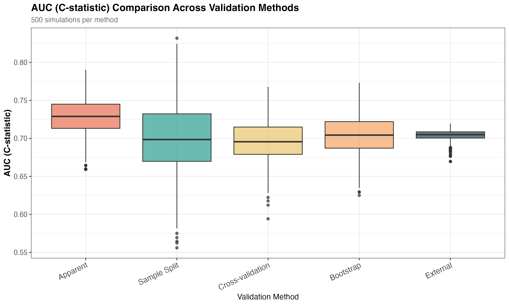
```

```{r}
#| label: fig-auc-density
#| fig-cap: "AUC density"
#| fig-width: 10
#| fig-height: 6

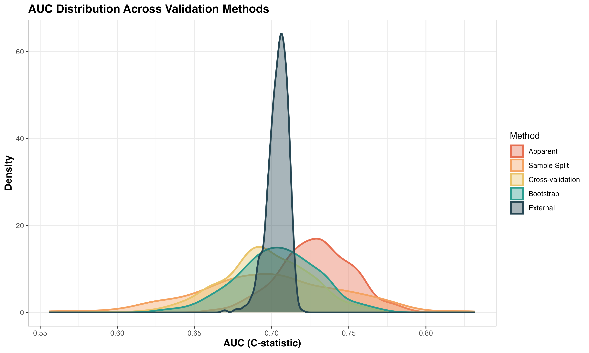
```

```{r}
#| label: fig-calibration
#| fig-cap: "Calibration slope"
#| fig-width: 10
#| fig-height: 6

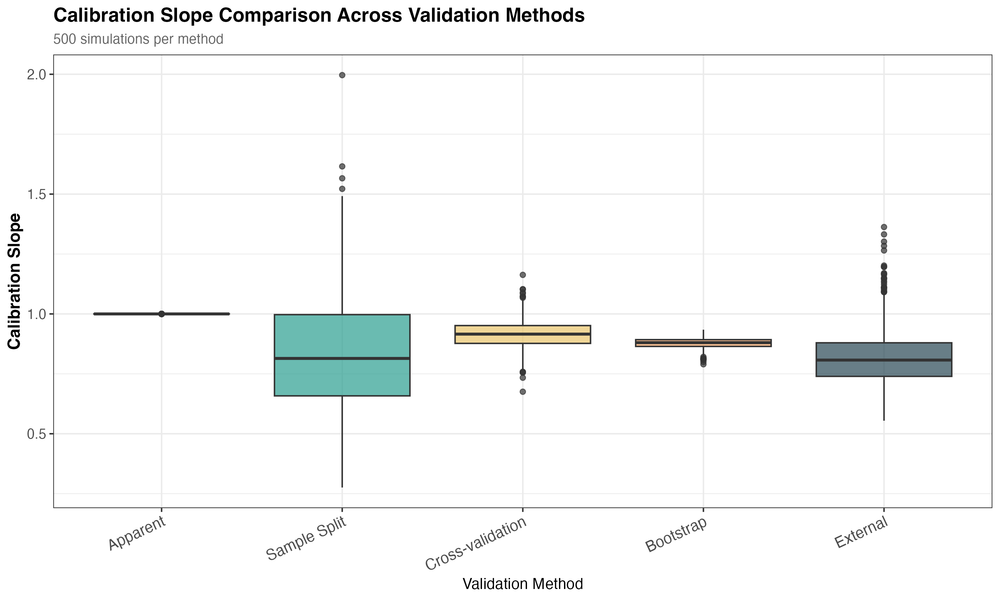
```

```{r}
#| label: fig-calibration-density
#| fig-cap: "Calibration slope density"
#| fig-width: 10
#| fig-height: 6

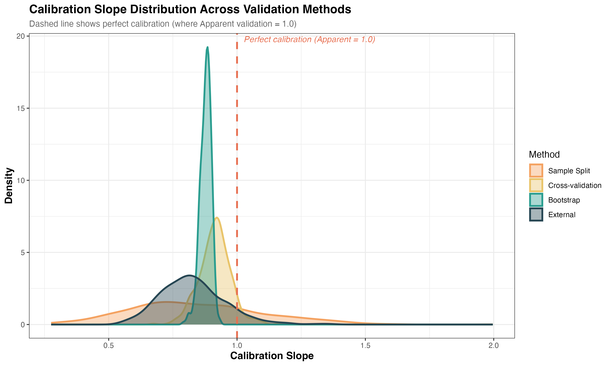
```

```{r}
#| label: fig-brier
#| fig-cap: "Brier score"
#| fig-width: 10
#| fig-height: 6

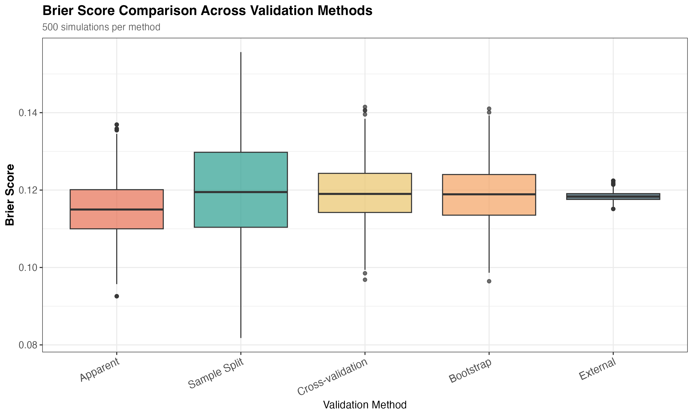
```

```{r}
#| label: fig-brier-density
#| fig-cap: "Brier score density"
#| fig-width: 10
#| fig-height: 6

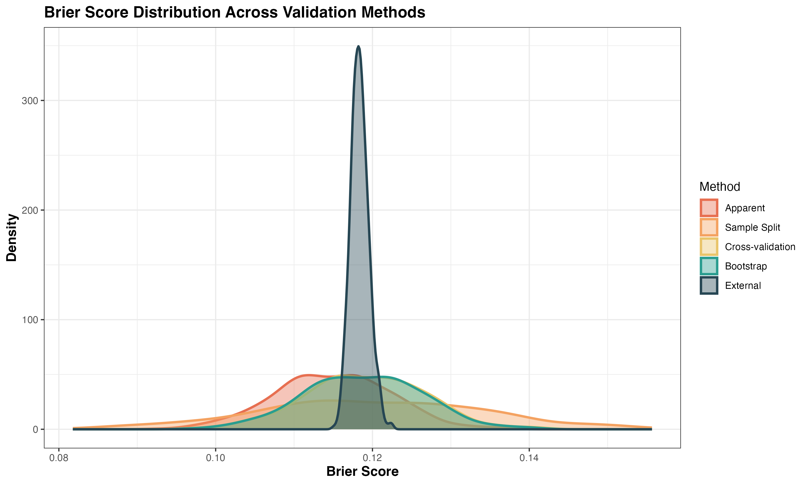
```

```{r}
#| label: fig-mape
#| fig-cap: "MAPE"
#| fig-width: 10
#| fig-height: 6

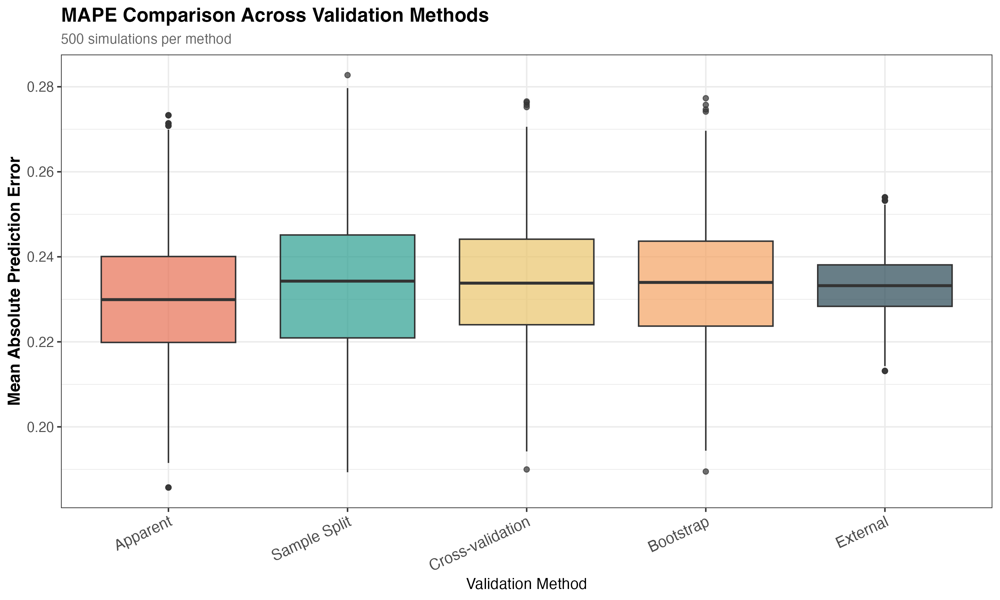
```

```{r}
#| label: fig-mape-density
#| fig-cap: "MAPE density"
#| fig-width: 10
#| fig-height: 6

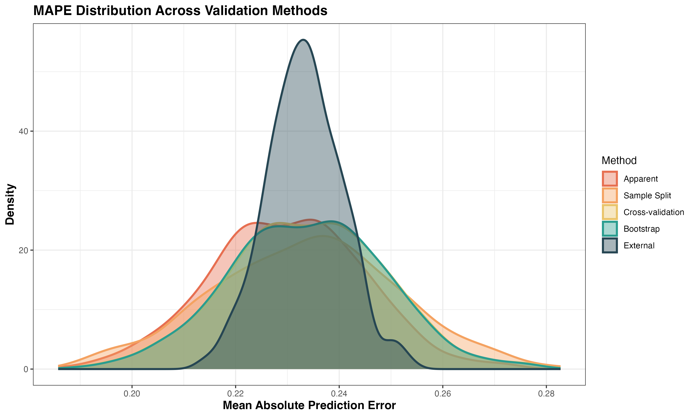
```

## Correlation with External Validation

These correlations use the matched external calibration slope from each method's fitted models. The previous mismatch compared refit-based internal slopes to the final-model external slope; here we align internal and external estimates by construction.

### Sample Split

```{r}
#| label: fig-corr-split
#| fig-cap: "Sample splitting"
#| fig-width: 10
#| fig-height: 8

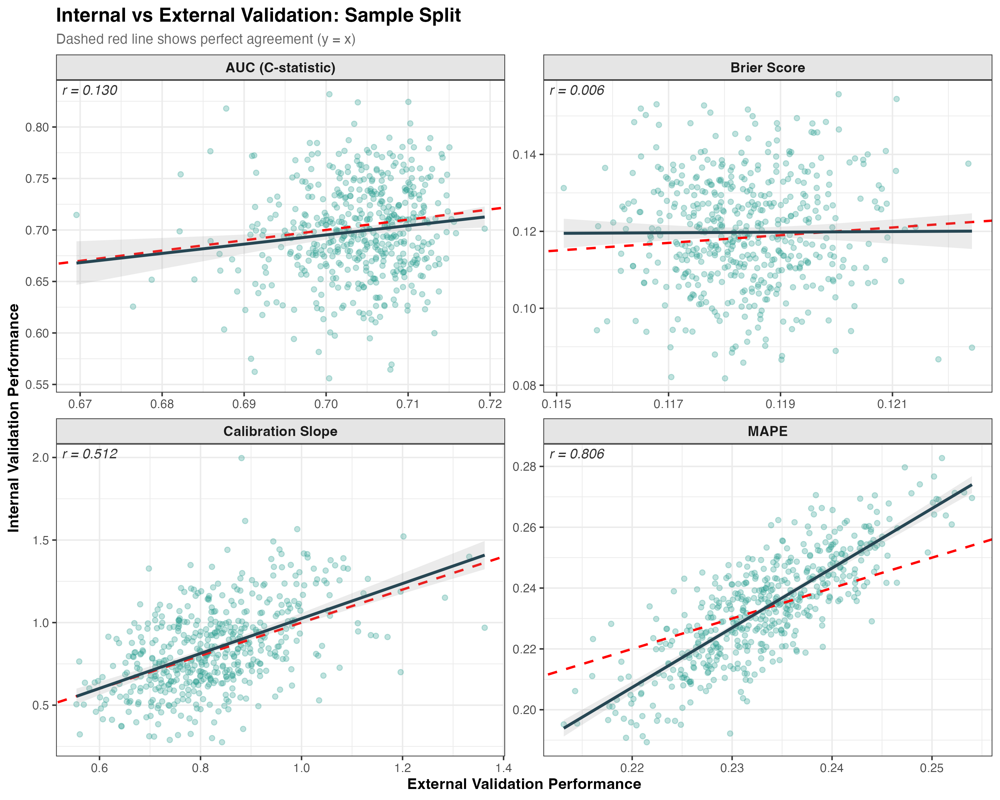
```

### Cross-validation

```{r}
#| label: fig-corr-cv
#| fig-cap: "Cross-validation"
#| fig-width: 10
#| fig-height: 8

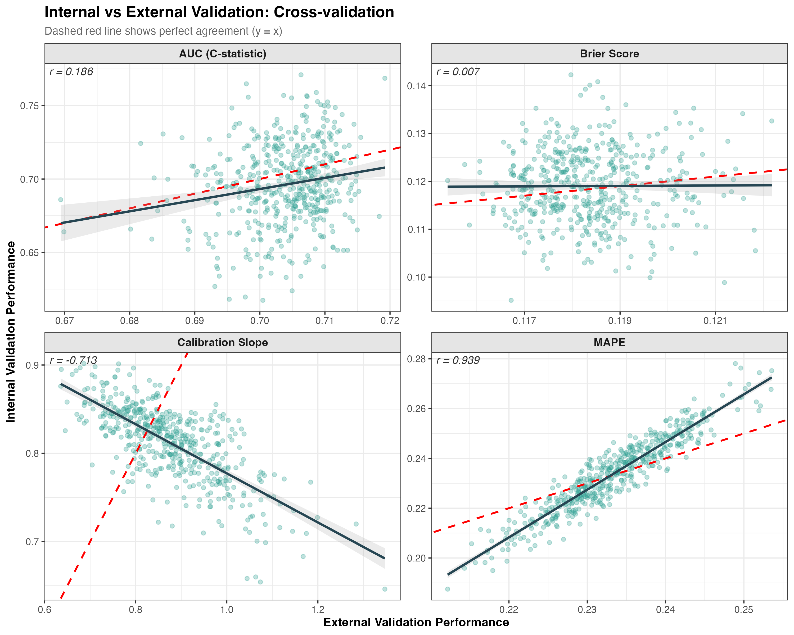
```

### Bootstrap

```{r}
#| label: fig-corr-boot
#| fig-cap: "Bootstrap"
#| fig-width: 10
#| fig-height: 8

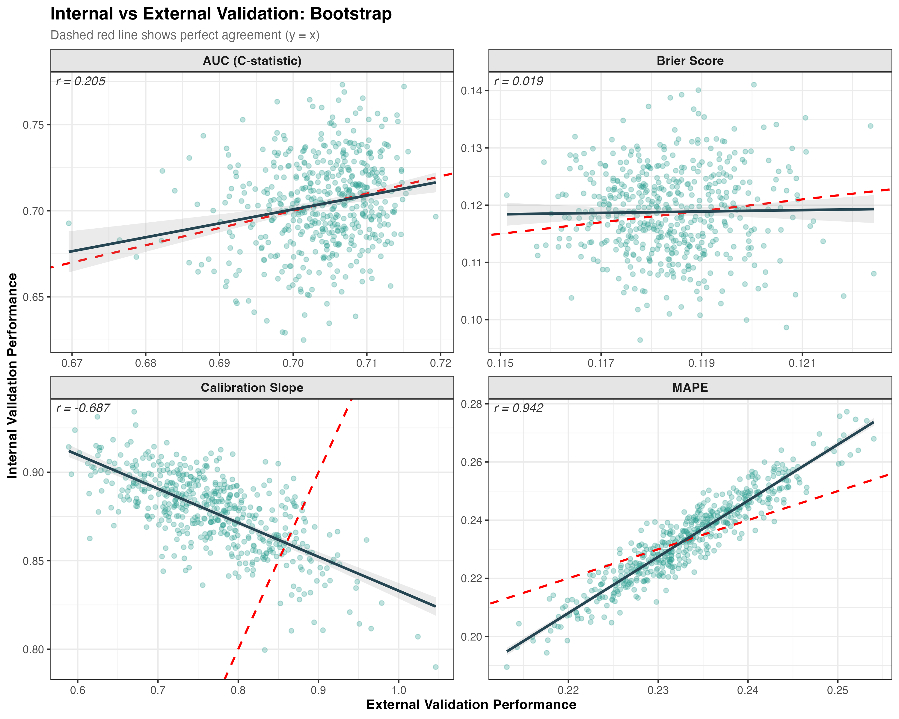
```

# External Validation Sample Size Requirements

```{r}
#| include: false

# Load external validation size results
ext_val_results <- read.csv("external_validation_size_results.csv")
ext_val_params <- read.csv("external_validation_size_parameters.csv")

# Get sample sizes
val_sizes <- unique(ext_val_results$val_size)
truth_size <- max(val_sizes)

# Calculate summary statistics by validation size
ext_summary <- ext_val_results %>%
  mutate(val_size_label = factor(
    ifelse(val_size >= 1000,
           sprintf("%gk", val_size / 1000),
           as.character(val_size)),
    levels = c("858", "1.716k", "3.432k", "6.864k", "13.728k", "27.456k", "54.912k", "100k")
  )) %>%
  group_by(val_size, val_size_label) %>%
  summarise(
    auc_mean = mean(auc),
    auc_sd = sd(auc),
    cal_slope_mean = mean(cal_slope),
    cal_slope_sd = sd(cal_slope),
    brier_mean = mean(brier),
    brier_sd = sd(brier),
    mape_mean = mean(mape),
    mape_sd = sd(mape),
    .groups = "drop"
  )

# Calculate correlations with truth (largest sample size)
correlations_with_truth <- ext_val_results %>%
  select(simulation, val_size, auc, cal_slope, brier, mape) %>%
  pivot_wider(
    id_cols = simulation,
    names_from = val_size,
    values_from = c(auc, cal_slope, brier, mape),
    names_prefix = "n_"
  )

# Correlation values for each metric
truth_col_auc <- paste0("auc_n_", truth_size)
truth_col_cal <- paste0("cal_slope_n_", truth_size)
truth_col_brier <- paste0("brier_n_", truth_size)
truth_col_mape <- paste0("mape_n_", truth_size)

cors_auc <- sapply(val_sizes[val_sizes != truth_size], function(s) {
  cor(correlations_with_truth[[paste0("auc_n_", s)]],
      correlations_with_truth[[truth_col_auc]])
})

cors_cal <- sapply(val_sizes[val_sizes != truth_size], function(s) {
  cor(correlations_with_truth[[paste0("cal_slope_n_", s)]],
      correlations_with_truth[[truth_col_cal]])
})

# Get specific correlation values for inline text
cor_858_auc <- cors_auc[1]
cor_858_cal <- cors_cal[1]
```

While internal validation methods help estimate model performance on the development data, external validation on independent data sets provide an honest test of a model's capacity to generalise. However, a key question remains: how large should an external validation data set be?

This section examines the relationship between external validation sample size and performance estimate stability, using models trained on the Pavlou-recommended sample size (n=`r n_dev`).

## Methods

For each of `r ext_val_params$value[ext_val_params$parameter == "n_simulations"]` simulations:

1.  Generate training data (n=`r n_dev`, following Pavlou's sample size recommendation)
2.  Fit a logistic regression model on the training data
3.  Validate the model on external datasets of varying sizes:
    -   n = `r paste(val_sizes, collapse = ", ")`
4.  Calculate performance metrics (AUC, calibration slope, Brier score, MAPE) for each validation size

This design isolates the effect of validation sample size on performance estimate variability and correlation with the asymptotic 'truth' (n=100,000).

## Performance Variability by Validation Sample Size

@fig-ext-val-auc to @fig-ext-val-mape show how performance-estimate variability decreases as validation sample size increases.

```{r}
#| label: fig-ext-val-auc
#| fig-cap: "AUC"
#| fig-width: 10
#| fig-height: 6

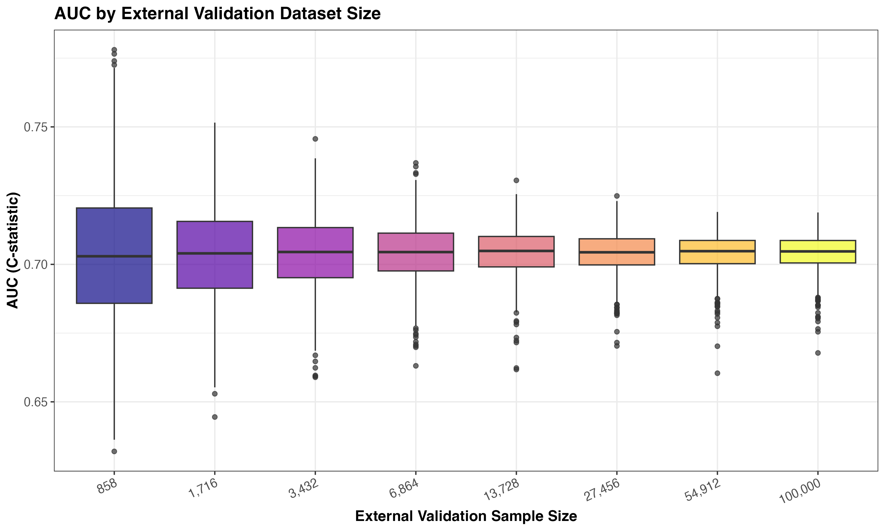
```

```{r}
#| label: fig-ext-val-calibration
#| fig-cap: "Calibration slope"
#| fig-width: 10
#| fig-height: 6

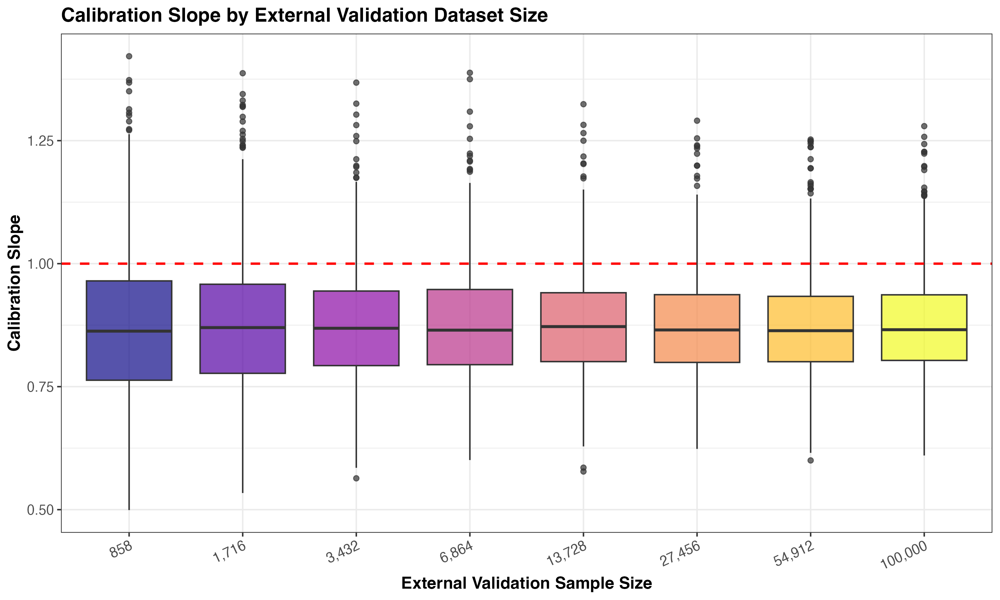
```

```{r}
#| label: fig-ext-val-brier
#| fig-cap: "Brier score"
#| fig-width: 10
#| fig-height: 6

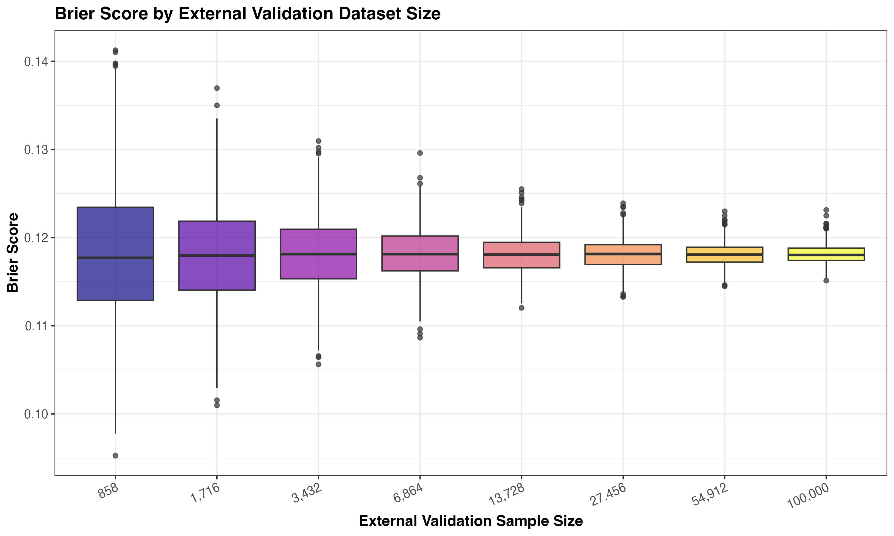
```

```{r}
#| label: fig-ext-val-mape
#| fig-cap: "MAPE"
#| fig-width: 10
#| fig-height: 6

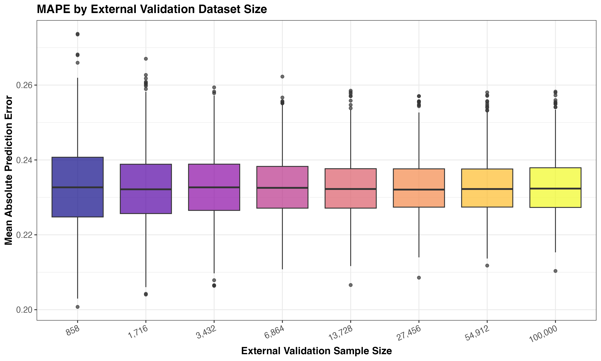
```

## Correlation with Asymptotic Truth

```{r}
#| label: fig-ext-scatter-auc
#| fig-cap: "AUC"
#| fig-width: 12
#| fig-height: 10

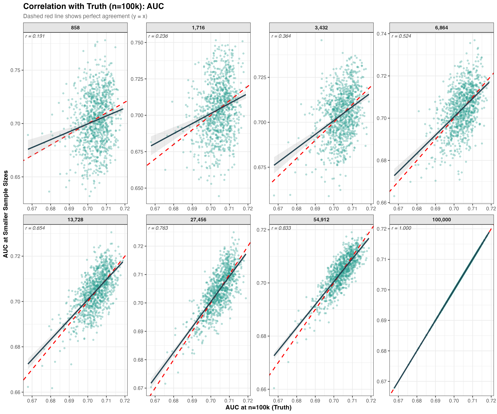
```

```{r}
#| label: fig-ext-scatter-cal
#| fig-cap: "Calibration slope"
#| fig-width: 12
#| fig-height: 10

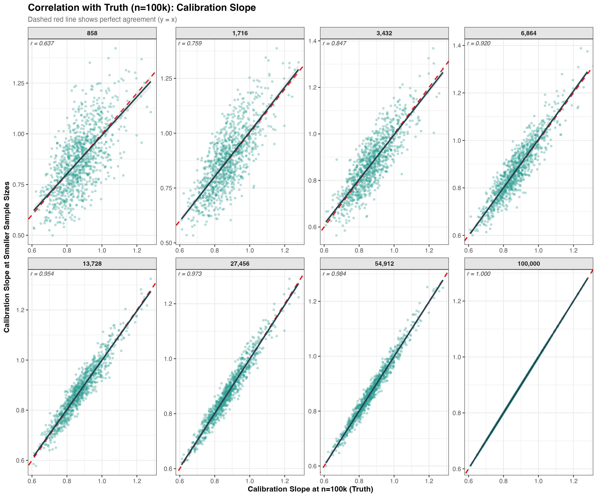
```

```{r}
#| label: fig-ext-scatter-brier
#| fig-cap: "Brier score"
#| fig-width: 12
#| fig-height: 10

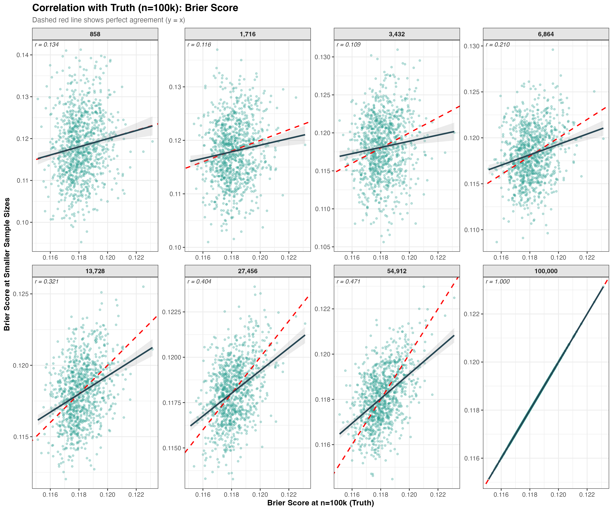
```

```{r}
#| label: fig-ext-scatter-mape
#| fig-cap: "MAPE"
#| fig-width: 12
#| fig-height: 10

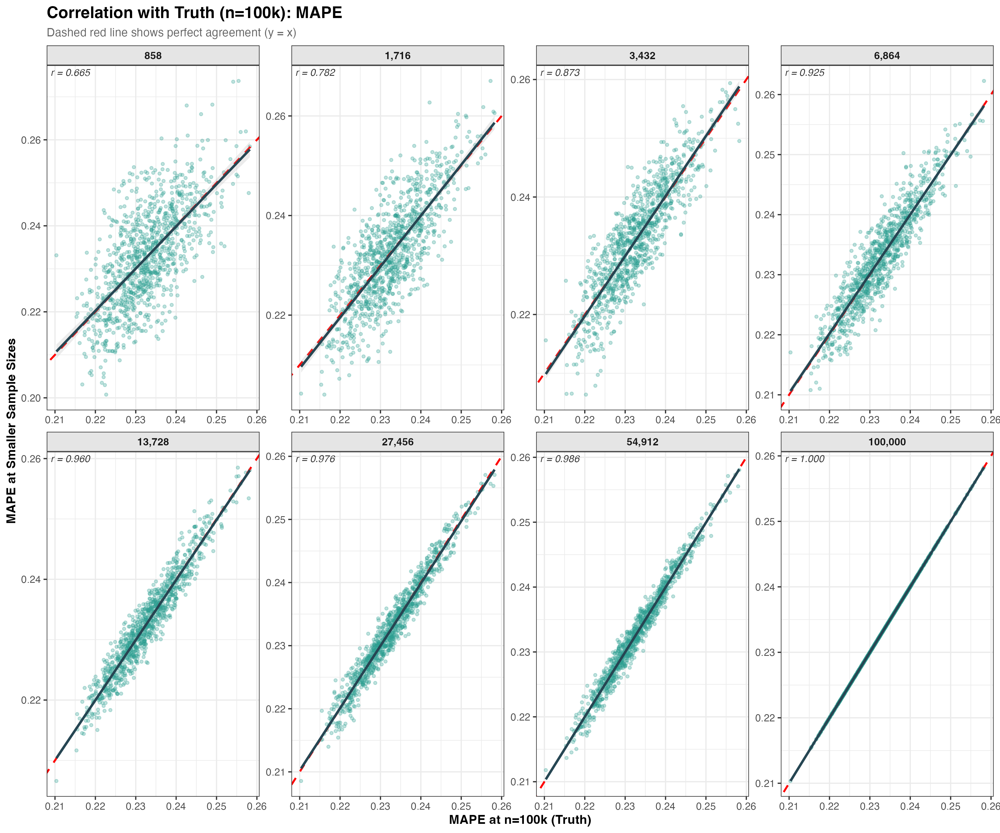
```

## External Validation Results

Calibration slope and MAPE achieve correlation = 0.9 somewhere between 4x and 6x the training size, while AUC requires 12x to achieve 83.5%. Brier Score never exceeds 0.5 correlation, even at 12x. Calibration, AUC and MAPE yield substantial improvements in variability with increasing validation sizes, while the Brier Score's variability hardly changes. Across the board, the marginal gain in precision diminishes substantially beyond \~10× the training size.

------------------------------------------------------------------------

## Code and Data Availability

Simulation code and generated data are available at \[https://github.com/AshleyMDickson/internal_validation_paper.git\].
